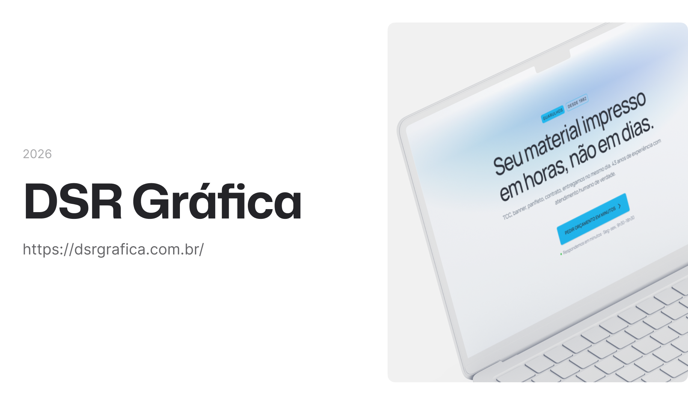

# DSR Gráfica | Landing Page Profissional

Landing Page desenvolvida para a **DSR Gráfica**, focada em **conversão**, **autoridade de marca** e **experiência do usuário (UX)**. O projeto apresenta uma interface moderna que comunica os 40 anos de tradição da gráfica através de uma navegação fluida, animações sofisticadas e performance otimizada.

---

### 🛠 **Tecnologias e Ferramentas**

Aqui estão as tecnologias utilizadas no desenvolvimento deste projeto:

* **Framework & Core:** React + Vite + TypeScript.
* **Tailwind CSS:** Estilização responsiva e consistente.
    * **CVA (Class Variance Authority):** Construção de componentes polimórficos com múltiplas variantes (ex: Botões e Tags).
    * **Clsx & Tailwind-Merge:** Gerenciamento inteligente de classes dinâmicas sem conflitos de especificidade.
* **Animação:** **Framer Motion** Animações de scroll e AnimatePresence.
* **Performance & UX:**
    * **Lucide React & Phosphor Icons:** Ícones leves e consistentes.
    * **Arquitetura Modular:** Componentização estratégica para alta escalabilidade e fácil manutenção.
    * **Mobile-First:** Interface totalmente responsiva e otimizada para dispositivos móveis.

---

### 💻 **Projeto**

Confira abaixo uma prévia e acesse o projeto completo [aqui](https://dsrgrafica.com.br/):



---

### ⚙️ Configuração Local

Caso deseje explorar o código ou rodar o projeto localmente:

1. **Clone o repositório:**
```bash
git clone https://github.com/murilloressineti/dsr-grafica-2.0
```

2. **Instale as dependências:**
```bash
pnpm install
```

3. **Inicie o servidor de desenvolvimento:**
```bash
pnpm dev
```

---

## 👨🏻‍💻 **Autor**

**Murillo Ressineti** — Desenvolvedor Front-end. Graduando em Análise e Desenvolvimento de Sistemas pela **Universidade Mackenzie** e imersão técnica pela **Rocketseat**.

• [LinkedIn](https://www.linkedin.com/in/murilloressineti/) • [E-mail](mailto:murillo@ressineti.com.br) • [Portfólio](https://murilloressineti.com.br/)

---

## 📝 **Licença**

Este projeto está sob a licença **MIT**. Para mais detalhes, consulte o arquivo [LICENSE](./LICENSE).